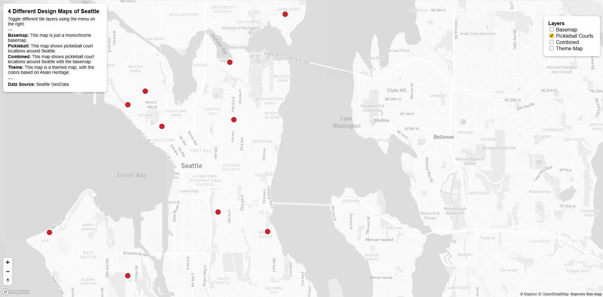
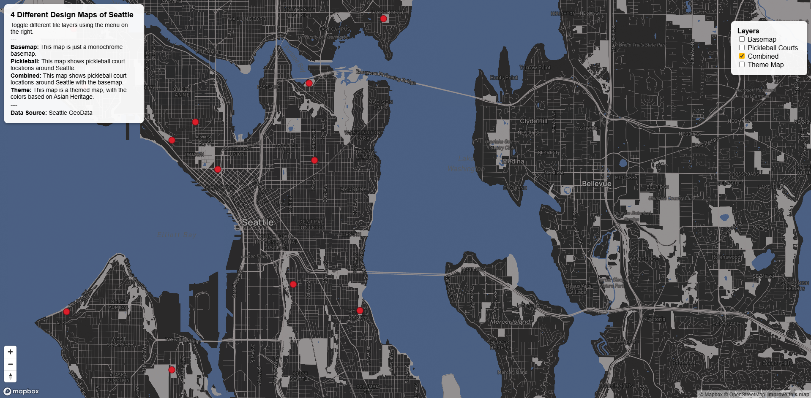
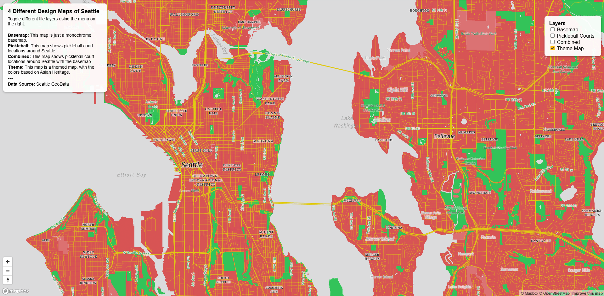

# 4 Different Tile Design Maps of Seattle

This project showcases four tile-based maps of Seattle built with Mapbox GL JS, demonstrating different approaches to basemap design, thematic mapping, and visual storytelling. The maps include a custom monochrome basemap, a thematic layer of pickleball court locations, a combined map for spatial context, and a culturally themed map highlighting Asian heritage in Seattle. Together, these maps illustrate how data, design, and interaction come together in a web mapping application.

## Web Map

You can view the interactive web map here:  
https://tralee10.github.io/Tiles_MapDesign/index.html

## Features

- Full-screen interactive map  
- Layer switcher to toggle different tile layers  
- Zoom in/out buttons  
- Map title and description with data source attribution

## Map Layers / Tile Sets / Images

1. **Basemap**

The basemap is a simplified dark monochrome map of Seattle designed to provide clear geographic context without overwhelming the viewer. It was created by modifying an existing classic Mapbox basemap style, including changes to color usage, label fonts, and icon styling, while keeping the overall look minimal and readable. The purpose of this basemap is to serve as a neutral background that highlights the city’s streets, neighborhoods, and waterfront, making it easier to understand where thematic layers are located in relation to Seattle’s urban layout.

   - Zoom levels: 10–14  
   - Examined area: City of Seattle

2. **Pickleball (Thematic Layer)**

This thematic layer displays the locations of pickleball courts across the City of Seattle using a geospatial dataset from the Seattle GeoData site. I chose this dataset because pickleball is a rapidly growing sport that originated in Washington, and Seattle has been actively incorporating pickleball courts into parks and recreation spaces. Mapping these locations helps visualize how the city supports this emerging sport and reveals patterns in where courts are concentrated. This layer focuses solely on the pickleball data, allowing users to explore the spatial distribution of courts without the influence of other map layers.  

   - Zoom levels: 10–13
   - Examined area: City of Seattle

3. **Combined (Basemap + Pickleball)**

The combined tile set overlays the pickleball court locations on top of the custom basemap to provide stronger spatial context. This layer allows users to see how pickleball courts relate to streets, neighborhoods, and other geographic features within Seattle. By integrating the thematic data with the basemap, the map becomes more informative and practical, helping users understand accessibility and clustering of courts across the city.

   - Zoom levels: 10–13
   - Examined area: City of Seattle

4. **Theme Map (Asian Heritage Colors in Seattle)**

The themed map is a custom Mapbox-designed layer that highlights Asian heritage in Seattle through deliberate use of colors and labeling styles. I chose this theme because Seattle has a long history of Asian communities and cultural influence, which is especially visible in neighborhoods such as the International District. The design emphasizes cultural identity using visual elements to communicate the theme and create a meaningful narrative map. This layer demonstrates how cartographic design choices can be used to express cultural significance and personal research interests beyond purely data-driven mapping.

   - Zoom levels: 10–13  
   - Examined area: City of Seattle

## Data Source

- **Basemap:** Mapbox Light/Dark style  
- **Pickleball Courts:** [Seattle GeoData Pickleball Courts Dataset](https://data-seattlecitygis.opendata.arcgis.com/datasets/SeattleCityGIS::pickleball-courts/explore?location=47.616431%2C-122.329550%2C11)
- **Theme Map:** Custom map design based on Asian Heritage  

